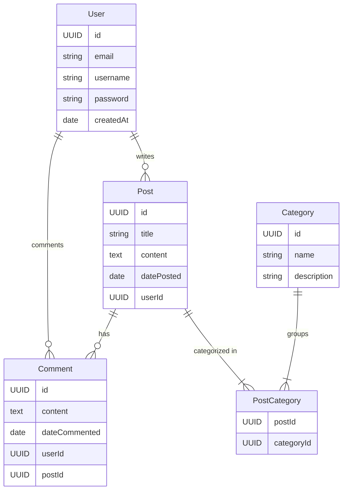
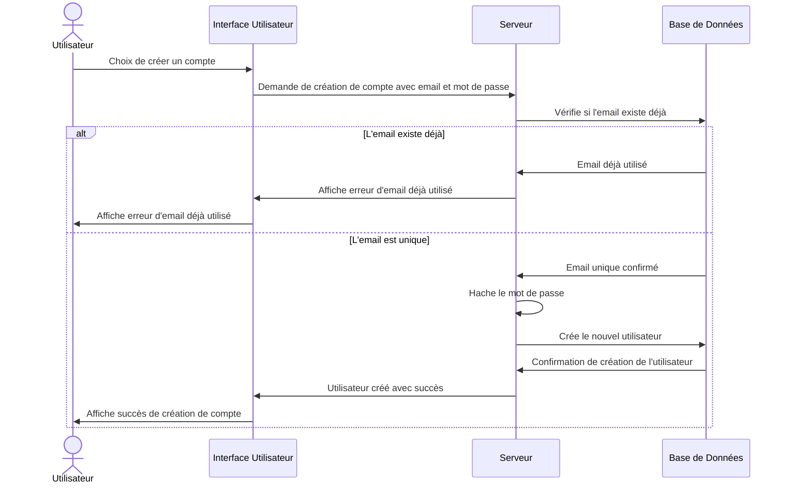
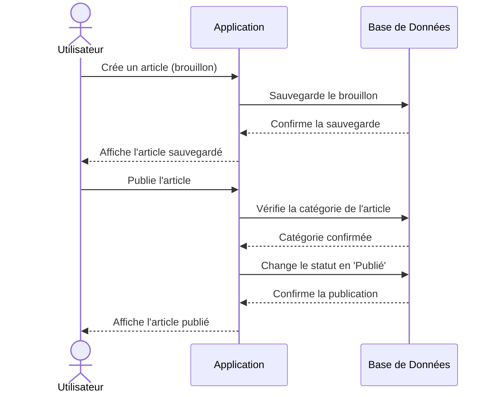

# Présentation de l’application  
!https://github.com/FrankTheHunter/masterpiece/blob/main/photo_2024-01-19_16-32-46.png
## Création d’une application pour le projet chef d’oeuvre du titre professionnel CDA
### 1. La Problématique
Problème : Risque d'accidents entre chasseurs et promeneurs en espaces naturels.
Solution : Une application qui informe les promeneurs des zones de chasse actives pour éviter les accidents.
L’aspect législatif pour les organisateurs de battues qui doivent déclarer de façon numérique la battue deux heures avant le début de celle-ci à leur fédération départementale.
### 2. Situation Actuelle
Existant : Manque d'outils mobiles dédiés à la prévention des accidents entre chasseurs et promeneurs.
Statistiques : 90 accidents, dont 8 mortels, avaient été recensés en 2022
### 3. Objectifs de l’Application
Augmenter la sécurité en espaces naturels.
Informer efficacement les promeneurs des zones de chasse.
Faciliter la déclaration des battues par les chasseurs à leurs fédérations
### 4. Description de l’Application
Application mobile permettant aux chasseurs de déclarer leurs zones de chasse et aux promeneurs de visualiser ces zones en temps réel.
### 5. Systèmes d’Exploitations
Choix : Disponible sur Android et iOS.
Technologie : Développement hybride pour couvrir les deux plateformes.
### 6. Modèle Économique de l’Application
Les fédérations assurerons les coûts liés à la maintenance de l’application via les cotisations réglées par leurs adhérents.
### 7. Fonctionnalités
1. Fonctionnalités
Déclaration de battue par les chasseurs.
Visualisation des zones de chasse pour les promeneurs.
Notifications de sécurité.
2. Back Office
Gestion des comptes utilisateurs.
Administration des zones de battue.
3. Les Contraintes
Fonctionnement en ligne avec options de notifications hors-ligne.
9. Spécifications Techniques
Définition des entités
User
id (UUID) : le numéro de permis de chasser unique pour chaque utilisateur. Il s’agit d’une clé primaire.
email (string) : L’adresse e-mail de l’utilisateur. utilisée pour l’identification et la communication.
firstname (string) : Le nom d’utilisateur. utilisé pour l’identification sur la plateforme.
lastname (string) : Le prénom d’utilisateur. utilisé pour l’identification sur la plateforme.
password (string) : Le mot de passe de l’utilisateur, stocké de manière sécurisée.
createdAt (date) : La date et l’heure de création du compte utilisateur.
Register driven hunting
id (UUID) : Un identifiant unique pour chaque enregistrement de battue. Il s’agit d’une clé primaire.
content (text) : Le contenu de l’article. Ce champ peut contenir une grande quantité de texte.
position (lat,long) : lieu de la battue avec coordonnées gps
datePosted (date) : La date et l’heure de publication de la battue.
userId (UUID) : L’identifiant de l’utilisateur qui déclaré la battue. Il s’agit d’une clé étrangère faisant référence à l’entité User.
Relations entre les entités
Dans notre modèle de données de l’application, les entités interagissent les unes avec les autres à travers divers types de relations qui reflètent la logique métier de l’application. Voici les détails des relations :
User hunting_session (1:N)
Relation : “register”
Description : Un utilisateur peut déclarer zéro, un ou plusieurs session de chasse (1:N). Chaque déclaration est renseignée par exactement un utilisateur.
Implémentation : La table hunting_session inclut une clé étrangère userId qui référence la clé primaire id dans la table User.

## Représentation des entités dans un diagramme

| Value (left) | Value (right) | Meaning                      |
|--------------|---------------|------------------------------|
| \|o          | o\|           | Zero or one                  |
| \| \|        | \| \|         | Exactly one                  |
| }o           | o\{           | Zero or more (no upper limit)|
| }\|          | \|\{          | One or more (no upper limit) |

## Règles Métier
Cette section présente les règles métier, qui sont les principes fondamentaux guidant le fonctionnement de notre application. Elles définissent comment les utilisateurs interagissent avec l’application et comment l’application réagit à ces interactions. Ces règles sont essentielles pour assurer que l’application fonctionne de manière logique et répond aux attentes des utilisateurs.
Pour réaliser des diagrame de séquence représentant des regles metier vous pouvez utiliser les sequenceDiagram de mermaid.
Création de compte utilisateur
Base de DonnéesServeurInterface UtilisateurBase de DonnéesServeurInterface Utilisateuralt[L'email existe déjà][L'email est unique]UtilisateurChoix de créer un compteDemande de création de compte avec email et mot de passeVérifie si l'email existe déjàEmail déjà utiliséAffiche erreur d'email déjà utiliséAffiche erreur d'email déjà utiliséEmail unique confirméHache le mot de passeCrée le nouvel utilisateurConfirmation de création de l'utilisateurUtilisateur créé avec succèsAffiche succès de

## création de compte Utilisateur

## Création d’une zone de battue

